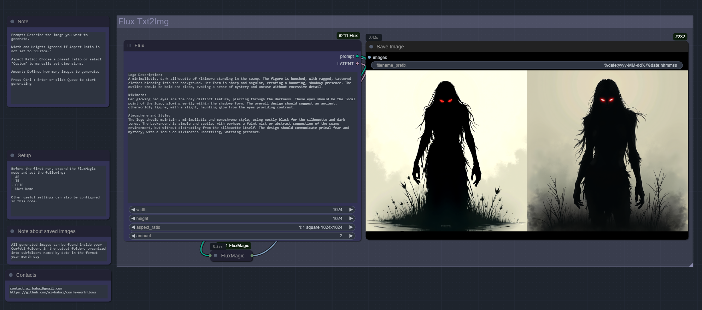

# ComfyUI Workflows

This repository contains a collection of **ComfyUI workflows**. These workflows are designed to streamline tasks in the ComfyUI interface, making them easier and more efficient to execute.

## Available Workflows

### 1. **Simple Text 2 Image - Flux**

This is a basic workflow for generating images from text using Flux. The workflow allows users to input a text prompt and convert it into an image with the help of various settings and nodes, including:

- **Prompt**: Describe the scene or image you want to generate.
- **Width** and **Height**: Ignored if **Aspect Ratio** is not set to "Custom."
- **Aspect Ratio**: Choose a preset ratio or select "Custom" to manually set dimensions.
- **Amount**: Defines how many images to generate.

Before the first run, expand the FluxMagic node and set the following parameter:
- ckpt_name

Press **Ctrl + Enter** or click **Queue** to start the process.

---
You can download the FLUX checkpoint from the following link:
- https://huggingface.co/Comfy-Org/flux1-dev/blob/main/flux1-dev-fp8.safetensors
- flux1-dev-fp8.safetensors 17.2 GB

or

- https://huggingface.co/Comfy-Org/flux1-schnell/blob/main/flux1-schnell-fp8.safetensors
- flux1-schnell-fp8.safetensors 17.2 GB

(for schnell, you need to set the steps to 4 in the FluxMagic node.)

[Download flux-text-2-image.json](./flux-text-2-image.json)

